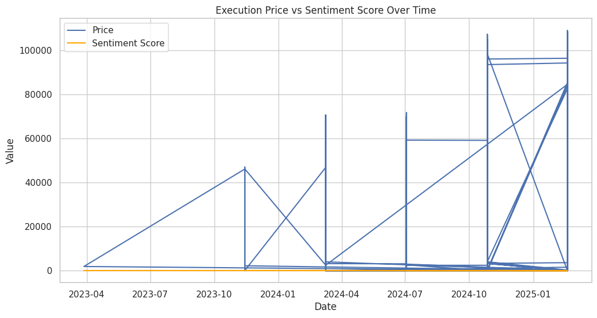

# Trader Sentiment Analysis

This project explores the relationship between market sentiment and trader behavior using real-world trade and sentiment data. The goal is to understand whether traders tend to buy at higher prices during “Greed” and lower during “Fear” conditions.

## 📌 Project Objectives

- Merge trade execution data with sentiment data by timestamp
- Clean and format timestamps for alignment
- Visualize how execution prices vary with sentiment
- Derive insights into behavioral trading patterns

## 📊 Key Insight

Trades were executed at **higher prices during Greed**, and **lower prices during Fear**, showing strong sentiment influence on trading behavior.

## 📁 Contents

| File/Folder | Description |
|-------------|-------------|
| `Trade_Sentiment_Analysis.ipynb` | Colab notebook with full analysis |
| `datasets/` | Contains the original trade and sentiment CSV files |
| `outputs/` | Generated plots and sample merged datasets |
| `insights_report.docx` | Written report summarizing key findings |
| `README.md` | Project overview and instructions |

## 🧹 Data Cleaning & Preparation

### 1. Trade Data
- Converted `'Timestamp IST'` to `datetime` format.
- Extracted date for merging and checked for missing values (none found).
- Renamed columns for clarity and ensured proper data types.

### 2. Sentiment Data
- Converted Unix `timestamp` to readable dates.
- Cleaned sentiment labels (`Fear`, `Greed`, etc.).
- Removed duplicates and handled missing data.

### 3. Merging
- Created a `date` column in both datasets.
- Merged using `pd.merge()` on the `date` field.
- Combined trade behavior with market sentiment.

### 4. Post-Merge Checks
- Verified no nulls after merging.
- Used `df.info()` and plots to inspect results.

 ## 📊 Visual Insights

### Sentiment vs Price

### Final Analysis Insights

## 🚀 Tools Used

- Python (pandas, matplotlib, seaborn)
- Google Colab
- CSV data handling and merging

